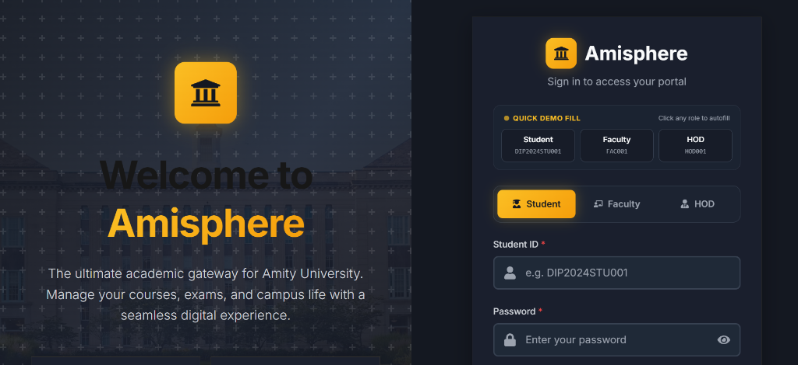
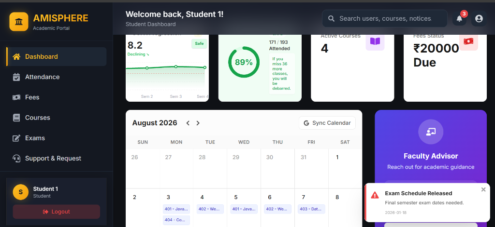
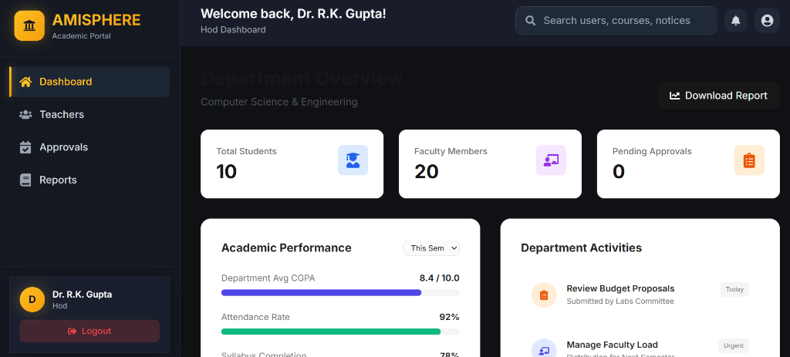

# AMISPHERE — Academic Management Portal

> **Amisphere** is a modern, enterprise-grade academic management web portal designed for educational institutions. Featuring role-based access control, interactive analytics, and seamless workflows for **Students**, **Faculty**, and **Heads of Department (HOD)**.

---

## 📸 Interface Preview & Visual Highlights

### 1. 🔐 Portal Login & Quick Demo Fill
*Featuring institutional dark theme aesthetics, split hero branding, role selector, and 1-click Quick Demo Fill.*



---

### 2. 🎓 Student Academic Dashboard
*Comprehensive student view with CGPA tracking, real-time attendance percentage warning badges, course timetable integration, fee status alerts, and instant notification popups.*



---

### 3. 👔 Head of Department (HOD) Overview
*Department-level analytics, faculty count metrics, academic performance averages, approval request queues, and downloadable reports.*



---

## 🌟 Key Features

### 🔐 Multi-Role Access Control
- **Student Portal**: Attendance tracker with safety limits, fee payment tracking, exam schedules & results, course list, and support ticket system.
- **Faculty Portal**: Today's class timetable, student request approvals/rejections/escalations, mark entries, notice announcements, and PDF notes publishing.
- **HOD Portal**: Departmental analytics, faculty overview, escalated approval resolution, academic performance tracking, and report generation.

### ⚡ Quick Demo Autofill
- Integrated 1-click credentials auto-fill bar on the login interface for effortless role testing.

### 📊 Rich Visualizations & Modern UX
- **Chart Integrations**: Recharts for academic trends and attendance circular metrics.
- **Responsive Layout**: Designed with Tailwind CSS & custom dark mode tokens.
- **Micro-Animations**: Framer Motion for smooth modal popups and dropdown transitions.

---

## 🛠️ Technology Stack

| Category | Technology / Library | Description |
| :--- | :--- | :--- |
| **Core Framework** | React 18.3 + Vite 6.0 | Fast HMR & optimized production bundling |
| **Styling** | Tailwind CSS 3.4 + Vanilla CSS | Dark theme design system & custom utilities |
| **Routing** | React Router DOM 7.x | Nested routes & role-based route protection |
| **Charts** | Recharts 3.x | Interactive data graphs & progress visuals |
| **State Management** | React Context API | Global data store & persistent auth state |
| **Icons & UI** | React Icons (FontAwesome) | High-contrast vector icon library |

---

## 🔐 Demo Credentials

| Role | User ID | Password | Access Level |
| :--- | :--- | :--- | :--- |
| **Student** | `DIP2024STU001` | `123` | Student Portal, Attendance & Fees |
| **Faculty** | `FAC001` | `123` | Class Management & Requests |
| **HOD** | `HOD001` | `123` | Department Overview & Approvals |

*Note: All roles can also be auto-filled directly using the **Quick Demo Fill** buttons on the login screen.*

---

## 📦 Local Setup & Development

### Prerequisites
- **Node.js**: `>= 18.x`
- **npm**: `>= 9.x`

### 1. Clone Repository
```bash
git clone https://github.com/shrayhere/Amisphere.git
cd Amisphere
```

### 2. Install Dependencies
```bash
npm install
```

### 3. Start Development Server
```bash
npm run dev
```
Access the application at `http://localhost:5173`.

---

## 📁 Project Architecture

```
Amisphere/
├── public/
│   ├── docs/                   # README screenshots & assets
│   │   ├── login_page.png
│   │   ├── student_dashboard.png
│   │   └── hod_dashboard.png
│   └── illustrations/          # Hero vectors & illustrations
├── src/
│   ├── components/             # Reusable UI components (Cards, Tables, Charts)
│   │   └── ui/                 # Core UI atoms (Button, Input, Toggle)
│   ├── context/                # AuthContext & DataContext providers
│   ├── layouts/                # DashboardLayout & Navigation bars
│   ├── pages/                  # Page modules
│   │   ├── student/            # Student dashboard pages
│   │   ├── teacher/            # Faculty dashboard pages
│   │   ├── hod/                # HOD dashboard pages
│   │   └── LoginPage.jsx       # Login & Quick Demo Fill screen
│   ├── styles/                 # Dark theme custom tokens
│   ├── App.jsx                 # Route definitions & protection
│   ├── index.css               # Tailwind directives & global layers
│   └── main.jsx                # Application root entry
├── tailwind.config.js          # Custom colors, shadows & extensions
└── package.json                # Project dependencies
```

---

## 📄 License & Attribution

Designed and developed for academic excellence at **Amity University**.  
*For educational & demonstration purposes.*
